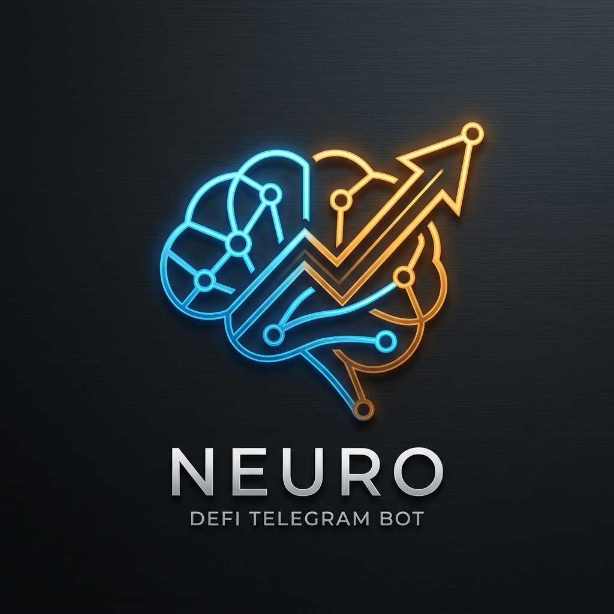

<p align="center">
  
</p>

# NEURO Protocol

Put your TON to work. Simply.

NEURO is a Telegram-native DeFi Yield Optimizer designed for the TON blockchain. Instead of demanding users to understand liquidity pools, impermanent loss, routing algorithms, or complex staking choices, NEURO distills TON-native yield opportunities into automated, guided portfolios:

- **Protect:** Low-volatility stable yields.
- **Earn:** Balanced risk/reward liquidity provisioning.
- **Grow:** High-upside algorithmic strategies.

The protocol abstracts away the complexity of base-layer protocols (STON.fi, Tonstakers) behind a calm, high-conversion interface, while our forthcoming **Smart Vaults (Automation Contracts)** handle autocompounding safely and transparently.

## The Vision

NEURO is built to become the ultimate yield aggregation layer for TON. The core value proposition is:
1. **Aggregated Yields:** One-click deployment of capital to the highest-yielding strategies across TON.
2. **Auto-Compounding (WIP):** Smart Vaults automatically harvest rewards and reinvest them to scale balances exponentially without active user management.
3. **Transparent Alignments:** We only make money if you make money. A strict performance-fee logic (High-Water Mark) ensures zero hidden fees on principal or losses.
4. **Contextual Security:** Replay protections, signed mutation proofs, and strictly audited message paths guarantee user funds remain protected.

## Features

- **Telegram-Native Integration:** Deep links and embedded MiniApp optimized for mobile consumption.
- **Goal-First Routing:** Deterministic plan generation mapping your goal to multi-protocol assets.
- **Control-Plane Reconciler:** A dedicated off-chain engine ensuring TonAPI transaction tracking to secure state mapping before any fee accrual.
- **Testnet Support:** Full functional mock-ups against STON.fi Sandbox for zero-risk integration testing.
- **Zero-Custody (Phase 1):** You sign your execution paths. Our vault architecture (Phase 2) will fully abstract routing through audited Tact Auto-Compounders.

## Architecture

NEURO uses a decoupled architecture allowing massive scalability on the frontend while deeply isolating execution domains.

```text
apps/
  miniapp/        Telegram-native frontend (Vite/React/Tailwind)
  control-plane/  Off-chain portfolio and reconciliation service (Node/Fastify)

packages/
  shared/         Contract and domain types
  domain/         Recommendation engine, fee logic
  adapters/       Protocol integration layer (STON, Tonstakers)
  contracts/      [In Development] Tact Automation Contracts (Yield Vaults)
```

## Quick Start

### Requirements
- Node.js 22+
- pnpm 10+

### Setup

```bash
pnpm install
```

### Running Locally

Run both the MiniApp and the local Control Plane:

```bash
pnpm dev
pnpm dev:control-plane
```

To run a fully isolated Docker stack:

```bash
docker compose up --build
```

### Accessing the Testnet

You can test NEURO without risking real funds:
1. Access the dApp in your browser via `http://localhost:5173`.
2. Click the **Flask** (🔬) icon in the top right to enable **Testnet Mode**. 
3. Connect your wallet (in Testnet mode) to sign sandbox payload routes. Read our [Testnet manual](docs/testnet-manual.md) for more info.

## Smart Vault Strategy (Automation)

Work is currently underway in `packages/contracts` to migrate Phase 1's non-custodial manual execution into absolute "set-and-forget" automation via **Smart Yield Vaults**. These Vaults, built in Tact, will securely hold LP shares, automatically index multi-protocol rewards (like STON tokens), swap them through cross-chain DEX paths, and auto-compound them securely into the user's underlying TON representation. 

This phase will undergo rigorous third-party auditing to protect against flash loans and re-entrancy vectors on the TVM.

## Security & Monetization

NEURO utilizes a rigorous fee model modeled around global DeFi standards (similar to Beefy). 
- We employ a standard performance fee (e.g. 10% - 20%) **uniquely attached to harvested yields**.
- No fees on principal.
- Protection models against flash drops and routing sandwich attacks are embedded within our quote aggregation layer.

---
*Disclaimer: NEURO is operating in beta access. Decentralized finance involves risks. None of the strategies presented are risk-free or guaranteed.*
